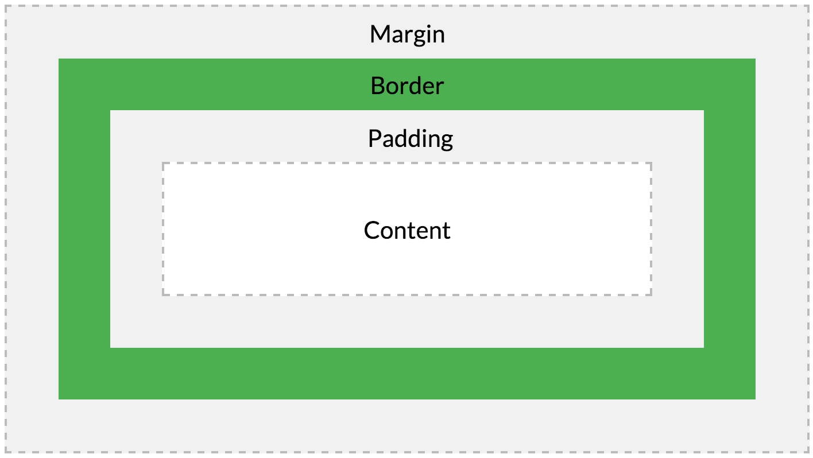

# 프론트엔드 면접 예상 질문과 답변 정리 👨‍💻

## 🙋‍♂️소개

프론트엔드 개발자가 되기 위해 알아야할 필수 내용들을 담고 있습니다.  
HTML, CSS, Javascript, 기타 용어 및 기술 파트로 구성되어 있으며  
해당 파트의 질문들과 답을 용어 설명과 함께 정리하고 있습니다.

### 목차

- [HTML](#HTML)
- [CSS](#CSS)
- [Javascript](#Javascript)
- [기타 용어 및 기술](#기타-용어-및-기술)
- [프로젝트 관련 예상 질문](#프로젝트-관련-예상-질문)

---

## ✨HTML

### !Doctype에 대해 설명하시오.

<details>
  <summary>답변 확인</summary>

> 웹 브라우저는 [쿼크모드(Quirks mode)](#-쿼크모드quirks-mode--오래된-브라우저의-행동-모방하여-렌더링)와 [표준모드(Standard mode)](#-표준모드standard-mode--w3c-표준에-따라-렌더링) 두 가지 렌더링 모드를 가지고 있다.  
> `<!DOCTYPE html>` (문서 형식선언)은 브라우저가 문서를 렌더링 할 때 쿼크모드로 바뀌지 않도록 하는 것이 목적이다. 만약 이를 선언하지 않았을 경우 웹 브라우저는 현재 버전의 엄격한 기준으로 과거 버전의 정상적으로 작성된 태그들을 문법 오류로 간주하는 오류가 생기게 된다. 브라우저는 선언된 Doctype에 따라 렌더링할 모드를 선택하게 되는데 이 과정을 Doctype sniffing 또는 Doctype switching이라고 한다. 브라우저가 출력하고자 하는 문서가 최신이라고 판단하면 표준모드로 렌더링을 하게 되고 예전 문서라고 판단 되면 쿼크모드로 렌더링을 하게 되는데 쿼크모드를 사용한다는 것은 오래된 웹페이지들이 최신 버전의 브라우저에서 렌더링 되도록 함에 목적이 있다.
>
> ###### 📝 쿼크모드(Quirks mode) : 오래된 브라우저의 행동 모방하여 렌더링  
> ###### 📝 표준모드(Standard mode) : W3C 표준에 따라 렌더링

</details>

### meta태그에 대해 설명하시오.

<details>
  <summary>답변 확인</summary>

> meta태그란 문서를 설명하는 태그를 일컫는다. 해당 문서가 어떤 내용을 담고 있고 문서의 핵심키워드는 무엇이며 누가 만들었는지, 문자셋은 어떤 것을 사용하는지 등의 다양한 정보를 담고 있는 태그이다.
>
> `http-equiv` `name` `content` 세가지의 속성이 있으며 설명은 아래와 같다.
>
> - `http-eqyiv` 속성은 문서에서 초기정보를 나타내는 속성으로 meta 요소에서 정의된 명령사항들을 먼저 실행한 후 페이지를 로딩한다. HTML 문서가 응답 헤더와 함께 웹 서버로부터 웹 브라우저에 전송되었을 때에만 의미를 갖는다. 기본언어(content-language), MIME 타입(content-type), 브라우저호환성설정(X-UA-Compatible), 페이지 리로드(refresh)등을 나타낼 수 있다.
> - `name` 속성값으로는 subject, title, author, keywords 등이 있다.  
>    검색엔진에게 문서의 내용을 요약해 주는 역할을 담당한다고 할 수 있다.
> - `content` meta태그의 정보를 지정해준다.

</details>

### 시맨틱태그에 대해 설명하시오.

<details>
  <summary>답변 확인</summary>

> HTML 문서의 구조를 설계하는 데에 있어 태그에 의미를 부여하여 문서의 구조 파악이 용이하도록 만든 태그를 말한다.
>
> #### ⚙ 시맨틱태그의 장점
>
> - **문서의 가독성이 높다**  
>   `div`가 과도하게 사용된 문서는 코드 가독성이 떨어져 작업 시 혼란을 야기시킬 수 있지만  
>   시맨틱태그는 이 문제점에서 벗어나 태그명만으로 해당 영역의 역할을 쉽게 파악할 수 있다.
>
> - **[SEO](#-seosearch-engine-optimize--웹사이트가-검색-결과에-더-잘-보이도록-최적화하는-과정) 최적화에 유리**  
>   검색 엔진이 태그의 목적에 부합하게 설계되어 있는 구조의 사이트에서  
>   더욱 빨리 정보를 파악할 수 있어 검색 결과 노출이 유리하다.
>
> - **[웹 접근성](#웹-표준과-웹-접근성에-대해-설명하시오) 효율적**  
>   스크린리더와 같은 환경의 사용자에게 사이트 이용성을 향상시킨다.
>
> #### ⚙ 시맨틱태그의 종류
>
> - `<header>` 머리글, 제목, 헤더
> - `<nav>` 네비게이션, 목차, 리스트 등 다른 페이지로의 이동을 위한 링크 공간을 위주로 표현
> - `<aside>` 좌측과 우측 사이드 위치의 공간을 의미하며, 본문 외에 부수적인 내용을 주로 표현하는 태그
> - `<section>` 주제, 카테고리 별로 섹션을 구분하는 용도의 태그로 주로 사용. 같은 테마를 가진 여러개의 콘텐츠의 그룹화
> - `<article>` 기사, 블로그 등 텍스트 위주의 페이지를 구성할때 주로 사용
> - `<footer>` 바닥글, 문서 하단에 들어가는 정보 구분 공간을 표현하는 태그
> - `<address>` 콘텐츠 작성자나 사이트 소유자의 정보등을 부가적으로 담는 기능
> - `<hgroup>` 제목과 관련된 부제목을 묶는 태그
> - `<main>` 문서 \<body\>의 중심 주제, 주요 내용 또는 응용 프로그램의 중심 기능과 직접 관련되거나 확장되는 콘텐츠를 나타낸다.
> - `<details>` 주변 문맥에서 표시된 구절의 관련성 또는 중요성으로 인해 참조 또는 표기 목적으로 표시되거나 강조된 텍스트를 나타낸다.
> - `<summary>` details 요소에 대한 요약, 캡션 또는 범례를 지정. summary 요소를 클릭하면 상위 details 요소의 상태가 열리고 닫힌다.
> - `<figure>` 이미지, 다이어그램, 사진 등 독립적인 컨텐츠 정의 시 사용
> - `<figcaption>` \<figure\> 요소의 설명 캡션(caption) 정의
> - `<mark>` 현재 맥락에 관련이 깊거나 중요한 부분 강조
> - `<time>` 시간의 특정 지점 또는 구간, datetime과 같은 속성을 이용해 알림 같은 기능 구현
>
> ###### 📝 SEO(Search Engine Optimize) : 웹사이트가 검색 결과에 더 잘 보이도록 최적화하는 과정

</details>

### 같은 기능을 하는 태그 간 차이에 대해 설명하시오.

<details>
  <summary>답변 확인</summary>

> - **`ul` `ol`의 차이**  
>   순서가 없는 목록(Unordered list)과 순서가 있는 목록(Ordered list)
> - **`dl` `dt` `dd` 란?**  
>   용어의 정의 목록(Description list)
> - **`strong` `b`와 `em` `i` 차이**  
>   [웹 접근성](#웹-표준과-웹-접근성에-대해-설명하시오)으로 접근했을 때에 차이가 존재한다.  
>   단순히 굵고 기울이게(b, i)가 아닌 중요, 강조(strong, em)하는 것에 차이가 있다.

</details>

### button 태그의 기본 type은 무엇이고 input[type="button"]과 차이는 무엇인가?

<details>
  <summary>답변 확인</summary>

> `button` 태그의 default type은 submit이다.  
> 따라서 submit 기능을 사용하지 않는 `button`이라면 type을 button으로 명시해주는 것이 좋다.  
> 가끔 `input`태그의 type을 button으로 명시하여 사용된 걸 볼 수 있는데 (`<input type="button">`)  
> 그 이유는 HTML4.0 표준부터 `<button>` 태그가 추가 되었기 때문이다.  
> 둘의 기능은 동일하지만 활용성 면에서 차이가 존재한다.  
> `<input>`은 열린 태그이기 때문에 자식 요소를 가질 수 없는 큰 단점을 가지고 있지만  
> `<button>` 태그는 자식 요소를 가질 수 있고 CSS를 활용하여 [가상요소](#가상요소pseudo-element-와-가상클래스pseudo-class에-대해-설명하시오) 꾸며주는 것이 가능하다.

</details>

### 취소선을 넣을 때 사용하는 태그는 무엇인가?

<details>
  <summary>답변 확인</summary>

> ```html
> <del>취소선 태그</del>
> ```

</details>

### 밑줄을 넣을 때 사용하는 태그는 무엇인가?

<details>
  <summary>답변 확인</summary>

> ```html
> <ins>밑줄 태그</ins>
> ```

</details>

### 오픈그래프(OG)에 대해 설명하시오.

<details>
  <summary>답변 확인</summary>

> 오픈그래프(OG, 오픈 그래프 프로토콜)는 HTML 문서의 [meta정보](#meta태그에-대해-설명하시오) 쉽게 표시하기 위해서  
> meta 정보에 해당하는 제목, 설명, 문서의 타입, 대표 URL 등 다양한 요소들에 대해서 사람들이 통일해서  
> 쓸 수 있도록 정의해놓은 프로토콜이며, 페이스북에 의하여 기존의 다양한 meta 데이터 표기 방법을  
> 참조하여 만들어졌다. 대부분의 콘텐츠는 URL로 공유되며 콘텐츠가 표시되는 방식을 관리하기  
> 위해 오픈 그래프 태그(OG TAG)로 웹사이트를 마크업하여 마케팅 효과를 낼 수 있다.

</details>

### 모바일에서 손가락으로 확대하는 것을 제어하는 방법은 무엇인가?

<details>
  <summary>답변 확인</summary>

> `minimum-scale` : 줄일 수 있는 최소 크기를 지정합니다. 0\~10 사이의 값을 가집니다.  
> `maximum-scale` : 늘릴 수 있는 최대 크기를 지정합니다. 0\~10 사이의 값을 가집니다.  
> `user-scalable` : yes 또는 no 값을 가지며 사용자가 화면을 확대/축소 할 수있는지는 지정합니다.

```html
<meta name="viewport" content="width=device-width, initial-scale=1.0, minimum-scale=2.0" />
<meta name="viewport" content="width=device-width, initial-scale=1.0, maximum-scale=2.0" />
<meta name="viewport" content="width=device-width, initial-scale=1.0, user-scalable=no" />
```

</details>

### XML과 XHTML에 대해 설명하시오.

<details>
  <summary>답변 확인</summary>

> XML과 XHTML 둘 다 마크업 언어로서 웹 문서 규격을 의미한다.  
> XML은 W3C에서 여러 특수 목적의 마크업 언어를 만드는 용도로 권장되는 다목적 마크업 언어이고 이것을 기반으로 과거 HTML 기능과 결합하여 만든게 XHTML이다.
>
> - 기존 HTML 마크업 언어 특징
>
>   - HTML User Agent가 오류에 대해서 상당히 관대하다.
>   - 잘못된 태그 사용 또는 중첩되거나 닫히지 않은 태그 등등으로 작성하여도 브라우저는 문제가 있는 부분을 허용하거나 무시된어 사용된다.
>   - Data의 의미 보다는 기술된 태그의 외향적인 표현에 집중되어 있다.
>   - 정보의 구조화 및 데이터간의 연관성 표현과 유효성 검증이 어렵다.
>
> HTML은 원래 마크업 언어를 만들기 위한 일종의 SGML의 응용 프로그램이다. SGML은 상당히 복잡하기 때문에 실제로 대부분의 브라우저가 이를 따르지 않았고, 실제 웹에서 사용되는 HTML은 SGML의 영향을 받은 커스터마이징된 마크업 언어이다. 이러한 기존의 HTML는 SGML 기반의 응용프로그램으로 사용자 편의성이 높지만 확장성과 융통성 부분이 단점으로 지적되어 왔다.
>
> - XML
>   - 기존 HTML의 한계를 보완하기 위해 만들어진 마크업 언어이다.
>   - 웹에서 HTML의 고정된 어휘 이상의 것을 사용하고 싶은 욕구에서 시작되었다.
>   - SGML과 같은 메타 마크업 언어지만, 일반 Parser를 더 쉽게 만들 수 있도록 단순화한 언어이다.
>   - XML의 X는 extensible 즉, 확장성의 의미를 담고 있으며, 이는 미리 정의된 태그가 아닌 커스텀 태그를 정의해 사용할 수 있다는 장점을 의미한다.
>   - HTML과 같은 문서의 형태를 보여주는게 아닌, Data 전달 및 표현에 초점이 맞춰져 있다.
>   - XML은 표현과 내용이 완전 분리되어 Data 구조 및 내용 기술이 가능하며, Stylesheet를 사용하여 다방면의 데이터 표현이 가능하다.
> - XHTML
>   - 기존 HTML과 XML의 장점을 하나로 합친 개념이다.
>   - 보다 구조화된 형식과 엄격한 문법을 갖고 있다.
>   - XHTML은 향상된 웹사이트 검색기능과 복잡한 데이터 처리가 가능하다.
>   - 엄격한 규칙을 사용하고 있어 문서가 손상될 가능성이 있다.
>   - Application/xhtml+xml 또는 text/xml로 제공되는 경우 자동으로 XHTML로 처리된다.  
>     단, IE 환경에서는 타입을 인지하지 못해 다운로드 처리되면, IE에 한해서만 text/html로 처리해 주는것이 좋다.

</details>

### 다국어가 포함된 페이지는 어떤 방식으로 제공하는지에 관하여 설명하시오.

<details>
  <summary>답변 확인</summary>

> 정적인 페이지라면 서버에서 언어코드로 HTML의 해당 언어와 대체하여 처리한다.

</details>

### data-속성에 대해 설명하시오.

<details>
  <summary>답변 확인</summary>

> data- 속성은 사용자 지정 데이터 특성이라는 특성 클래스를 형성함으로서 임의의 데이터를 script로 HTML과 DOM 사이에서 교환할 수 있는 방법이다.
>
> ```html
> <button type="button" data-idx="1004" data-btn-name="Angel">Button</button>
> ```
>
> ```javascript
> let bntIdx = document.querySelector('button').dataset.idx; // 1004
>
> //data속성의 이름에 하이픈이 있을 경우 camelCase로 변환한다.
> let bntName = document.querySelector('button').dataset.btnName; // Angel
> ```

</details>

### Cookie와 Session, Web Storage에 대해 설명하시오.

<details>
  <summary>답변 확인</summary>

> - Cookie(쿠키)
>   - 쿠키는 클라이언트 로컬에 저장되는 키와 값이 들어있는 데이터 파일이다.
>   - Javascript에서 document.cookie로 현재 쿠키 정보를 알 수 있다.
>   - 사용자 인증이 유효한 시간을 명시할 수 있으며 유효시간이 정해지면 브라우저가 종료되어도 인증이 유지된다.
>   - 쿠키는 클라이언트의 상태 정보를 로컬에 저장했다가 참조한다.
>   - 클라이언트에 300개까지 저장이 가능하며 하나의 도메인당 20개의 값만 가질 수 있다.  
>     하나의 쿠키 값은 4KB까지 저장된다.
>   - 매 HTTP 요청마다 포함되며 과도한 API호출은 서버에 부담을 줄 수 있다.
>   - 암호화가 존재하지 않으며 사용자 정보 도난의 위험이 있다.
> - Session(세션)
>   - 사용자 정보를 파일 브라우저에 저장하는 쿠키와 다르게 세션은 서버 측에서 관리한다.
>   - 서버에서 클라이언트를 구분하기 위해 세션 ID를 부여하며, 웹 브라우저가 서버에 접속해서 브라우저를 종료하기 전까지 인증상태를 유지한다.
>   - 접속 시간에 제한을 두어 일정 시간 응답이 없으면 인증이 유지되지 않도록 설정이 가능하다.
>   - 데이터를 서버에 두기 때문에 쿠키보다 보안성이 뛰어나지만 사용자가 많아질수록 서버 메모리를 많이 차지하게 된다.
> - Web Storage(웹 스토리지)
>   - 클라이언트에 데이터를 저장할 수 있도록 HTML5 이후부터 추가된 저장소이며 [로컬스토리지](#-로컬스토리지--사용자가-데이터를-지우지-않는-이상-브라우저에-영구적으로-남아있는다)와 [세션스토리지](#-세션스토리지--데이터가-origin뿐만-아니라-브라우저-탭에도-종속되기에-창을-닫을-경우-제거된다)가 있다.
>   - Key와 Value 형태로 데이터를 저장한다.
>   - 쿠키와 다르게 자동 전송의 위험성이 없다.
>   - Origin 단위로 접근이 제한되는 특성 덕분에 CSRF로부터 안전하다.
>   - 쿠키보다 큰 저장 용량을 지원한다. (모바일 2.5MB/데스크탑 5~10MB)
>   - 서버가 HTTP 헤더를 통해 스토리지 객체를 조작할 수 없어 보안성이 좋다.
>
> ###### 📝 로컬스토리지 : 사용자가 데이터를 지우지 않는 이상 브라우저에 영구적으로 남아있는다.  
> ###### 📝 세션스토리지 : 데이터가 Origin뿐만 아니라 브라우저 탭에도 종속되기에 창을 닫을 경우 제거된다.

</details>

### 점진적 렌더링(Progressive rendering)에 대해 설명하시오.

<details>
  <summary>답변 확인</summary>

> 점진적 렌더링은 서버에서 웹 페이지의 일부를 순차적으로 렌더링하고 전체 페이지가 렌더링 될 때까지 기다리지 않고 부분적으로 클라이언트에 스트리밍 하는 기술이다.  
> 점진적 렌더링을 이해하려면 먼저 [CSR(Client Side Rendering)과 SSR(Server Side Rendering)](#ssrserver-side-rendering과-csrclient-side-rendering에-대해-설명하시오)이 어떻게 작동되는지 알아야한다.

</details>

---

## ✨CSS

### CSS 적용 우선순위에 대해 설명하시오.

<details>
  <summary>답변 확인</summary>

> 1.  `!important`를 붙인 속성
> 2.  태그에 inline으로 작성된 속성
> 3.  #id로 지정한 속성
> 4.  클래스, 가상 클래스로 지정한 속성
> 5.  태그 이름으로 지정한 속성
> 6.  상위 객체에 의해 상속된 속성

</details>

### CSS 길이 단위에는 어떤 것들이 있는가?

<details>
  <summary>답변 확인</summary>

> #### 절대 길이
>
> | 단위 | 이름       | 다음과 동일         |
> | ---- | ---------- | ------------------- |
> | cm   | Centimeter | 1cm = 96px/2.54     |
> | mm   | Millimeter | 1mm = 1/10th of 1cm |
> | Q    | 1/4 mm     | 1Q = 1/40cm         |
> | in   | Inch       | 1in = 2.54cm = 96px |
> | pc   | Picas      | 1pc = 1/6 in        |
> | pt   | Point      | 1pt = 1/72 in       |
> | px   | Pixel      | 1px = 1/96 in       |
>
> #### 상대 길이
>
> | 단위 | 다음과 동일                               |
> | ---- | ----------------------------------------- |
> | em   | 요소의 글꼴 크기                          |
> | ex   | 요소 글꼴의 x-height.                     |
> | ch   | 요소 글꼴의 glyph "0" 의 사전 길이 (너비) |
> | rem  | 루트 요소의 글꼴 크기                     |
> | lh   | 요소의 라인 높이                          |
> | vw   | viewport 너비의 1%                        |
> | vh   | viewport 높이의 1%                        |
> | vmin | viewport wnd 작은 치수의 1%               |
> | vmax | viewport 의 큰 치수의 1%                  |

</details>

### CSS로 세모를 만드는 방법은 무엇인가?

<details>
  <summary>답변 확인</summary>

> ```css
> div {
>   width: 0;
>   height: 0;
>   border-bottom: 50px solid transparent;
>   border-top: 50px solid transparent;
>   border-left: 50px solid red;
>   border-right: 50px solid transparent;
> }
> ```

</details>

### CSS Sprite에 대해 설명하시오.

<details>
  <summary>답변 확인</summary>

> CSS Sprite란 웹 사이트의 로딩 속도를 빠르게 하기 위한 최적화 기법 중의 하나로  
> 여러개의 이미지를 하나의 이미지로 합쳐서 관리하는 기술을 의미한다.
>
> #### ⚙ CSS Sprite의 장점
>
> - 리소스를 다운로드를 최소화 하여 새롭게 로딩되는 경우에도 이미지 로드 블링킹 현상이 없다.
>
> #### ⚙ CSS Sprite의 단점
>
> - 이미지 용량이 크다면 로딩시 매우 오래 걸릴 수 있다.
> - 사용하고자 하는 이미지의 position을 알아야 하며 이벤트 적용시 번거로움이 있다.

</details>

### CSS flex에 대해 설명하시오.

<details>
  <summary>답변 확인</summary>

> 웹 페이지의 레이아웃을 구성할 때 사용되는 CSS속성으로 기존 `inline-block` `float` `position`과  
> 같은 속성의 문제점과 한계를 보완한 속성이다.  
> flexible box, flexbox라고도 부르는 flex는 레이아웃 배치 기능에 중점을 두어  
> 고안되었기 때문에 기존 방식보다 훨씬 수월한 레이아웃 배치 작업이 가능하다.

</details>

### CSS 전처리기에는 어떤 것들이 있고 무엇인지 설명하시오.

<details>
  <summary>답변 확인</summary>

> CSS를 프로그래밍화하여 사용하는 것으로 CSS를 사용할 때 생기는 문제점과 번거로움을 보완한다.
> Mixin, Nesting 등과 같은 기능으로 CSS 구조를 가독성있고 유지보수하기 좋게 한다.  
> Less, Sass, Stylus 등과 같은 전처리기가 있으며 해당 파일을 컴파일하여 CSS포맷으로 변환한다.

</details>

### 가상요소(Pseudo element) 와 가상클래스(Pseudo class)에 대해 설명하시오.

<details>
  <summary>답변 확인</summary>

> - 가상요소란 실제로 존재하지 않는 가상의 요소를 만들어 CSS로 제어하는 것을 말한다.  
>   CSS2에서는 콜론(:)으로 사용할 수 있었지만 CSS3 이후로 이중콜론(::) 사용을 권장한다.  
>   대표적인 가상요소로 ::after ::before가 있다.
> - 가상클래스란 실제로 존재하는 요소에 특정 이벤트나 환경에 맞춰  
>   가상으로 클래스를 줘서 CSS로 제어하는 것을 말한다.  
>   대표적인 가상클래스로 :hover가 있다.

</details>

### :root 가상 클래스에 대해 설명하시오.

<details>
  <summary>답변 확인</summary>

> 문서 트리의 root 요소를 선택한다. html문서의 root 요소는 `<html>` 요소이므로  
> :root의 명시도가 더 높다는 점을 제외하면 html 선택자와 동일하다.

</details>

### 전역 CSS변수 선언하는 방법은 무엇인가?

<details>
  <summary>답변 확인</summary>

> ```css
> :root {
>   --main-color: hotpink;
>   --common-padding: 5px 42px;
> }
>
> div {
>   color: var(--main-color);
>   padding: var(--common-padding);
> }
> ```

</details>

### CSS Class와 Id의 차이점은 무엇인가?

<details>
  <summary>답변 확인</summary>

> - `Class`
>   주어진 class 특성을 가진 모든 요소를 선택한다.
> - `Id`
>   id 특성에 따라 요소를 선택한다. 문서 내에는 주어진 id를 가진 요소가 하나만 존재해야 한다.
>   [적용 우선 순위](#css-적용-우선순위에-대해-설명하시오) : id > class

</details>

### rest.css를 사용하는 이유는 무엇인가?

<details>
  <summary>답변 확인</summary>

> reset.css를 사용하는 가장 큰 이유는 크로스브라우징 때문인데 웹 브라우저마다 `margin` 이나 `padding` 등 각기 다른 default 스타일이 지정되어있다. 때문에 해당 값들을 초기화 함으로써 다양한 웹 브라우저에서도 동일한 스타일이 적용될 수 있도록 설정한다.

</details>

### float이 어떻게 동작하지 설명하시오.

<details>
  <summary>답변 확인</summary>

> `float` 속성은 주로 레이아웃을 구성할 때 블록 레벨요소를 가로 정렬하기 위해 사용되는 기법이다.
> flexbox가 등장하기 이전에 주로 사용된 기법이었으나 지금은 사용하지 않는 추세이다.  
> float 속성은 해당 요소를 다음 요소 위에 부유하게(떠있게) 한다. 여기서 부유한다는 의미는 해당 요소가 리본 레이아웃 흐름에서 벗어나 요소의 모서리가 페이지의 왼쪽이나 오른쪽에 이동하는 것이다.
> |속성 값|설명|
> |-|-|
> |none|요소를 떠있게 하지 않는다. (기본값)|
> |right|요소를 오른쪽으로 이동시킨다.|
> |left|요소를 왼쪽으로 이동시킨다.|

</details>

### z-index에 대해 설명하시오.

<details>
  <summary>답변 확인</summary>

> CSS `z-index` 속성은 위치 지정 요소와 그 자손 또는 하위 요소들의 Z축 순서를 지정한다.  
> 더 큰 `z-index` 값을 가진 요소가 작은 값의 요소 위를 덮는다.

</details>

### 블록 서식 맥락(Block Formatting Context)에 대해 설명하시오.

<details>
  <summary>답변 확인</summary>

> BFC는 웹 페이지를 렌더링하는 시각적 CSS의 일부로서 블록 박스의 레이아웃이 발생하는 지점과 floating 요소의 상호작용 범위를 결정하는 범위이다.  
> 쉽게 말해서 block 속성이 재부여되어 다르게 렌더링 되는 현상을 말한다.
>
> - 문서의 root 요소 (`<html>`)
> - floating 요소 (`float`이 `none`이 아닐 때)
> - 절대 위치를 지정한 요소 (`position`이 `absolute`, `fixed`)
> - `display` 속성 값이 `inline-block` 일 때
> - 표 칸(`display가` `table-cell`, HTML 표 칸의 기본값)
> - 표 주석(`display가` `table-caption`, HTML 표 주석의 기본값).
> - `display가` `table`, `table-row`, `table-row-group`, `table-header-group`, `table-footer-group`  
>   (HTML 표에서, 각각 표 전체, 행, 본문, 헤더, 푸터의 기본값) 또는 `inline-table`인 요소가 암시적으로 생성한 무명 칸.
> - `overflow`가 `visible`이 아닌 block 요소
> - `display가` `flow-root`
> - `contain`이 `layout`, `content`, `paint`
> - 스스로 플렉스, 그리드, 테이블 컨테이너가 아닌 경우의 플렉스 항목 (`display가` `flex` 또는 `inline-flex`인 요소의 바로 아래 자식)
> - 스스로 플렉스, 그리드, 테이블 컨테이너가 아닌 경우의 그리드 항목(`display가` `grid` 또는 `inline-grid`인 요소의 바로 아래 자식)

</details>

### IR(Image Replacement) 기법이란 무엇이고 어떤 것들이 있는지 설명하시오.

<details>
  <summary>답변 확인</summary>

> IR 기법은 이미지를 볼 수 없는 사용자들에게 적절한 대체 텍스트를 제공하는 것으로 이는 [웹 접근성](#웹-표준과-웹-접근성에-대해-설명하시오) 준수 뿐만아니라 효과적인 [SEO](#-seosearch-engine-optimize--웹사이트가-검색-결과에-더-잘-보이도록-최적화하는-과정)를 위해 요구되는 기법이다.  
> img태그에는 `alt` 속성으로 표현하지만 CSS `background-image`로 표현된 이미지 요소에 대체 텍스트를 추가해주는 방법은 다음과 같다.
>
> - Phark Method
>   - 의미 있는 이미지의 대체 텍스트를 제공하는 경우
>   - 이미지로 대체할 요소에 배경이미지를 설정하고
>     > ```css
>     > .ir_pm {
>     >   display: block;
>     >   overflow: hidden;
>     >   font-size: 0;
>     >   line-height: 0;
>     >   text-indent: -9999px;
>     > }
>     > ```
> - WA IR
>   - 의미있는 이미지의 대체 텍스트로 이미지가 없어도 대체 텍스트를 보여주고자 할 때
>   - 이미지로 대체 할 엘리먼트에 배경이미지를 설정하고 글자는 span 태그로 감싼 후 z-index:-1을 이용하여 화면에 보이지 않게 처리
>     > ```css
>     > .ir_wa {
>     >   display: block;
>     >   overflow: hidden;
>     >   position: relative;
>     >   z-index: -1;
>     >   width: 100%;
>     >   height: 100%;
>     > }
>     > ```
> - Screen Out
>   - 대체 텍스트가 아닌 접근성만을 위한 숨김 텍스트를 제공할 때
>     > ```css
>     > .ir_so {
>     >   overflow: hidden;
>     >   position: absolute;
>     >   width: 0;
>     >   height: 0;
>     >   line-height: 0;
>     >   text-indent: -999px;
>     > }
>     > ```

</details>

### 시각적으로 보이지 않고 스크린리더에서만 가능하게 하는 방법은 무엇인가?

<details>
  <summary>답변 확인</summary>

> - `display: none` 영역이 사라지며 콘텐츠가 보이지 않는다.
> - `visibility: hidden` 영역은 남아 있으나 콘텐츠는 보이지 않는다.
> - block 요소에 `width:0; height: 0;` `overflow: hidden`

</details>

### CSS Selector의 동작원리에 대해 설명하시오.

<details>
  <summary>답변 확인</summary>

> - 선택자(Selector) 가장 마지막에 있는 선택자를 Key 선택자라고 하는데 스타일 엔진은 이 Key 선택자부터 왼쪽으로 이동하면서 ID, Class, Tag, Universal 규칙에 부합하는 검사하면서 파싱을 진행한다.

</details>

### 효율적인 CSS를 작성하기 위한 방법에는 어떤 것들이 있는가?

<details>
  <summary>답변 확인</summary>

> - 선택자는 상위 선택자를 포함하여 3개 이상 작성하지 않는다.
> - 전체 선택자(\*)를 사용하지 않는다.
> - 정규 표현식`.regex-selector[type^="value"]: {...}`과  
>   유사한 attribute 선택자(`[type="text"]: {...}`❌ `input[type="text"]: {...}`⭕) 사용을 지양한다.
> - ID 선택자를 사용하지 않는다.
>   - ID는 하나의 HTML파일에 유일하게 존재하는 값이다. ID 선택자를 사용한다는 것은 스타일을 한 요소에만 적용한다는 것인데 이러한 구조는 스타일 규칙의 재사용이 불가능하게 만들어 CSS 파일 사이즈를 크게 만들고 유지보수와 확장성에 불편함을 가져오게 된다.
> - Class 규칙에 불필요한 태그를 조합하여 사용하지 않는다.
> - Tag 선택자 규칙에 상위 선택자로 태그를 포함하지 않는다.
>   - HTML 문서 수정에 따른 CSS 파일 수정을 최소화 하기 위해 태그 규칙에 상위 선택자로 Tag 선택자를 사용하지 않는다.

</details>

### position: absolute 와 transform: translate()의 차이는 무엇인가?

<details>
  <summary>답변 확인</summary>

> `position: absolute`와 `transform: translate()`는 비슷해보이나 근본적인 목적이 다르기 때문에 구별하여 사용해야 한다.
>
> - 사용목적
>   - `position: absolute`는 특정 위치에 가져다 놓는 포지셔닝에 특화되어 있다.
>   - `transform: translate()`는 애니메이션에 목적을 두고 있다.
> - 영향
>   - `position: absolute`는 주변 요소에 영향을미친다.
>   - `transform: translate()`는 좌표 공간을 변형시켜 다른 형제, 부모요소에 영향을 미치지 않는다.
> - 성능
>   - `position: absolute` 는 레아이웃을 계산하기 위해 CPU 연산처리가 동반되고 연산 후에는 reflow와 repaint가 발생하여 속도 저하를 불러올 수 있다.
>   - `transform: translate()`같은 CSS3 애니메이션 함수는 GPU로 처리하기 때문에 성능면에서 우위에 있다.

</details>

### CSS position 속성 값엔 어떤 것들이 있고 차이는 무엇인가?

<details>
  <summary>답변 확인</summary>

> - `static` : `position`속성의 기본 값으로 다른 요소와의 관계에 의해 자동으로 배치되며 `top, right, bottom, left` offset 값을 지정할 수 없다.
> - `relative` : 기존 위치를 기준으로 좌표를 지정한다. 기존 위치는 `position: static` 상태일 때를 기준으로 한다.
> - `absolute` : 문서의 흐름과 상관없이 절대 좌표와 함께 위치를 지정할 수 있다. 해당 속성은 기준점이 중요한데 상위 요소 중 속성이 `static`이 아닌 것 중 가장 가까운 요소를 기준으로 한다.
> - `fixed` : `absolute` 속성과 비슷하지만 좌표의 기준점은 viewport의 좌측 상단 꼭지점으로 한다.
> - `sticky` : 해당 속성은 기준점을 넘지 않을 때는 `relative` 처럼 동작하지만 기준점을 벗어나면 `fixed`처럼 동작하며 scroll이 계속 되면 마지막 위치에서 멈추게 된다. 일반적인 상황에서 `sticky` 속성의 기준점은 부모 요소가 된다.

</details>

### Box Model에 관해 설명하고 브라우저에서 어떻게 동작하는지 설명하시오.

<details>
  <summary>답변 확인</summary>

> Box Model이란 HTML 요소가 웹 페이지에서 차지하는 공간을 정의한 모델이다.  
> 각 HTML 요소들은 자신만의 영역을 가지며 다시 여러개의 작은 영역으로 나뉜다.
>
> 
>
> - Content 영역
>   콘텐츠 경계가 감싼 영역으로 글이나 이미지, 비디오 등 요소의 실제 내용을 포함하는 영역으로 `width, height` 속성을 갖는다.
> - Padding 영역
>   padding edge가 감싼 영역으로 콘텐츠 영역을 요소의 안쪽 여백까지 포함하는 크기로 확장이 가능하다. 요소에 적용된 배경의 색과 이미지는 패딩 영역까지 적용된다.
> - Border 영역
>   테두리 영역으로 border 속성 값은 테두리의 두께를 의미한다.
> - Margin 영역
>   테두리 바깥에 위치하는 요소의 외부 여백 영역

</details>

### CSS box-sizing: border-box에 대해 설명하시오.

<details>
  <summary>답변 확인</summary>

> `box-sizing` 속성의 기본값은 `content-box`이다. `content-box`는 `width, heighht` 속성의 대상이 content 영역임을 의미한다.  
> 반면 `border-box` 속성은 `margin` 속성을 제외한 Box Model 전체를 `width, height` 속성의 대상 영역으로 계산함으로 `content-box`보다 직관적이라고 할 수 있다.

</details>

### CSS display 속성 inline과 inline-block의 차이점은 무엇인가?

<details>
  <summary>답변 확인</summary>

> - `inline` > `block`과 달리 줄바꿈이 일어나지 않고 content크기 만큼의 `width, height`를 가지고 있다. `width, height` 값을 지정할 수 없다.
> - `inline-block` `inline`과 동일하지만 `width, height` 값을 지정할 수 있다.

</details>

### CSS에서 'C’는 Cascading을 의미하는데 Cascading에 관해서 설명하시오.

<details>
  <summary>답변 확인</summary>

> Cascading은 '위에서 아래로 상속, 종속하는' 의미이다. 따라서 적용된 여러 스타일 중에서 어떤 스타일로 브라우저에 렌더링 할 지 결정하는 원리로 이해할 수 있다.  
> ⚙ [CSS 적용 우선순위](#css-적용-우선순위에-대해-설명하시오)

</details>

### CSS 방법론이란 무엇이고 어떤 것들이 있는가?

<details>
  <summary>답변 확인</summary>

> CSS 방법론이란 프로젝트의 규모가 커지는 만큼 CSS도 그만큼 증가하고 복잡해진다.  
> 불필요한 작업을 최소화 하고 작성된 코드를 쉽게 파악하고 유지보수와 확장성까지 고려하기 위한 일관적인 작성 규칙을 말한다.  
> 대표적인 방법론으로 OOCSS, SMACSS, BEM 등이 있다.

</details>

---

## ✨Javascript

### 호이스팅(Hoisting)에 대해 설명하시오.

<details>
  <summary>답변 확인</summary>

> 인터프리터가 변수와 함수의 메모리 공간을 선언 전에 미리 할당하는 것을 의미한다.  
> 동기적으로 작성되지 않아도 변수와 함수는 최상위에서 먼저 실행된다.

</details>

### var, let, const 차이에 대해 설명하시오.

<details>
  <summary>답변 확인</summary>

> - `var`는 변수의 선언과 초기화가 동시에 이루어진다. 별도의 값을 할당하지 않을 시 undefined가 할당 된다.  
>   변수명이 중복되어도 에러메시지가 나오지 않으며 사용하지 않는 걸 권장한다.
> - `let`은 코드 블록 내에서 선언된 변수는 코드 블록 내에서만 유효하여 코드 블록 외부에서는 참조할 수 없다.  
>   즉, [블록 레벨 스코프](#-블록-레벨-스코프--함수-if-while-등-내에서-선언된-변수는-해당-블록-내에서만-유효하며-외부에서는-참조할-수-없다)를 따르며 변수의 선언과 초기화 단계가 분리되어 진행된다.  
>   초기화 이전에 변수에 접근하면 참조 에러가 발생한다.
> - `const`와 `let`의 차이는 `const`는 값을 재할당 하는 것이 불가능하며 재선언 할 수도 없다.  
>   즉, 초기화된 값 이외에 다른 값을 할당하는 것이 불가능하다. 이는 보안에 이점이 있다.
>
> ###### 📝 블록 레벨 스코프 : {}(함수, if, while 등) 내에서 선언된 변수는 해당 블록 내에서만 유효하며 외부에서는 참조할 수 없다.

</details>

### Javascript 파일을 로드 할때 defer, async는 각각 무엇인지 설명하시오.

<details>
  <summary>답변 확인</summary>

> Javascript는 Parser blocking resource(파서 차단 리소스)이다.  
> 브라우저는 문서를 파싱해 읽다가 script를 만나면 진행하고 있던 파싱을 멈추고 script를  
> 다운로드 > 파싱 > 실행한 후에 다시 문서를 파싱한다.  
> `async`와 `defer` 없이 기본모드로 사용할 경우 script 다운로드/파싱/실행될 때까지  
> 브라우저의 문서(HTML) 파싱이 중단되어 사용자 화면 로드가 지연된다.
>
> - `async` 속성은 문서를 파싱하는 동안 script를 만나면 문서 파싱과 함께 script를 다운로드 하고  
>    다운로드가 완료되는 즉시 script를 실행한다.  
>    파일이 먼저 다운로드 되는 순서로 병렬적으로 실행되기 때문에 동기적으로 실행되어야하는  
>    여러개의 script 파일이 존재할 경우 즉, script가 의존적일 경우에 에러가 생길 수 있다.  
>   `async` 속성은 [DOM](#-domdocument-object-model--문서-객체-모델-html-문서에-접근하기-위한-일종의-인터페이스이다)을 조작하지 않고 script 의존성이 없는 코드에 적합하다.
> - `defer` 속성은 브라우저가 script를 만났을 때 다운로드와 문서 파싱을 동시에 수행하되  
>    script의 실행은 \</html\>를 만났을 때 실행된다.  
>   DOM을 조작해 HTML 의존성이 있을 때 문서가 모두 파싱된 이후에 script가 실행되어야 할 때 적합하다.
>
> ###### 📝 DOM(Document Object Model) : 문서 객체 모델. HTML 문서에 접근하기 위한 일종의 인터페이스이다.

</details>

### AJAX에 대해 설명하시오.

<details>
  <summary>답변 확인</summary>

> Asynchronous Javascript And Xml(비동기식 자바스크립트와 xml)의 약자이다.  
> 브라우저가 가지고있는 XMLHttpRequest 객체를 이용해서 전체 페이지를 새로 고치지 않고도 페이지의 일부만을 위한 데이터를 로드하는 기법이며 JavaScript를 사용한 비동기 통신, 클라이언트와 서버간에 XML 데이터를 주고받는 기술이다.

</details>

### 이벤트 전파방지에 대해 설명하시오.

<details>
  <summary>답변 확인</summary>

```html
<div id="div_">
  DIV영역
  <p id="p_">
    P영역
    <span id="span_">SPAN영역</span>
  </p>
</div>
```

> 최상위에 있는 `div`태그를 클릭했을 때는 `div`를 클릭한 결과만 나타나지만, 가장 아래에 있는 `span`태그를 클릭할 경우 `p`와 `div`의 클릭 이벤트까지 모두 동작하게 된다. 즉, 이벤트가 전파되는 것이다. 이러한 이벤트 전파를 막기 위해 사용하는 코드는 아래와 같다.

```javascript
// 현재 이벤트의 기본 동작을 중단한다.
event.preventDefault();

// 현재 이벤트가 상위로 전파되지 않도록 중단한다.
event.stopPropagation();

// 현재 이벤트가 상위뿐 아니라 현재 레벨에 걸린 다른 이벤트도 동작하지 않도록 중단한다. (이벤트 중첩 방지)
event.stopImmediatePropagation();

// jQuery를 사용할 때는 preventDefault() stopPropagation()를 사용한 것과 같고,
// jQuery를 사용하지 않을 때는 preventDefault()와 같다
return false;
```

</details>

### jQuery attr(), prop()의 차이에 대해 설명하시오.

<details>
  <summary>답변 확인</summary>

> `.attr()` 메소드와 `.prop()` 메소드의 차이점을 알기 위해서는 속성(attribute)과 프로퍼티(property)의 차이점을 알아야 한다. 속성(attribute)이란 HTML 요소의 추가적인 정보를 가지고 있는 이름과 값의 한 쌍을 의미한다.  
> \<input\>요소는 checked라는 속성(attribute)을 가지고 있으며, 그 속성값은 “checked"이다.
> 프로퍼티(property)란 속성을 객체화하였을 때의 HTML [DOM](#📝-domdocument-object-model--문서-객체-모델-html-문서에-접근하기-위한-일종의-인터페이스이다) 트리 내부에서의 값을 가리킨다.  
> 만약 체크박스가 체크되면 checked 프로퍼티 값은 “true"이다.
> 즉, 속성은 HTML 문서에 존재하고 값이 변하지 않으며, 프로퍼티는 HTML DOM 트리에 존재하고 그 값이 변할 수 있다. 예를 들어, 사용자가 HTML 문서에 있는 \<input\>요소를 체크하거나 자바스크립트를 이용해 값을 변경하면, 속성값은 변하지 않지만 프로퍼티의 값은 변하게 되는 것이다.

</details>

### 클로저(Closure)에 대해 설명하시오.

<details>
  <summary>답변 확인</summary>

> 함수와 [렉시컬 환경](#-렉시컬-환경lexical-environment--block-function-script를-실행하기-앞서-생성되는-스코프-범위-안에-있는-변수화-함수를-프로퍼티로-저장하는-객체이다)의 조합을 말한다.  
> 함수가 생성된 당시의 외부 변수를 기억하고 생성된 이후에도 계속 접근 가능하다.
>
> ###### 📝 렉시컬 환경(Lexical Environment) : block, function, script를 실행하기 앞서 생성되는 스코프 범위 안에 있는 변수화 함수를 프로퍼티로 저장하는 객체이다.

```javascript
function makeAdder(x) {
  return function (y) {
    return x + y;
  };
}

const add3 = makeAdder(3);
console.log(add3(2)); // 5

const add10 = makeAdder(10);
console.log(add10(5)); // 10
console.log(add3(1)); // 4
```

</details>

### Arrow Function(화살표 함수)를 언제, 왜 사용하는가?

<details>
  <summary>답변 확인</summary>

> - 화살표 함수는 함수 본연의 기능을 직관적으로 잘 표현한다.
> - 인자값이 하나라면 소괄호 생략이 가능하며 중괄호 안 코드가 `return` 뿐이라면 `return`도 생략이 가능하다.
>
> > ```javascript
> > let add2 = function (x) {
> >   return x + 2;
> > }; // 기존 방식
> >
> > let add2 = (x) => x + 2; // 화살표 함수
> > ```
>
> - 화살표 함수는 내부에서 외부의 `this` 값을 그대로 사용한다.

</details>

### 이벤트 위임(Event delegation)에 대해 설명하시오.

<details>
  <summary>답변 확인</summary>

> 이벤트 위임 기법은 각 요소마다 이벤트 핸들러를 할당하지 않고 요소의 공통 조상에 이벤트 핸들러를 할당하여 여러 요소를 한꺼번에 다룰 수 있다. 공통 조상에 할당한 핸들러에서 `event.target`을 이용하면 어디서 이벤트가 발생했는지 알 수 있는데 이를 이용해 이벤트를 핸들링한다.

</details>

### this는 Javascript에서 어떻게 작동하는지 설명하시오.

<details>
  <summary>답변 확인</summary>

> `this`는 호출 패턴에 따라 다른 객체를 참조한다. 실행 컨텍스트가 생설될 때 마다 `this`의 바인딩이 일어나며 우선순위 순으로 나열하면 다음과 같다.
>
> 1. `new`를 사용했을 때 해당 객체로 바인딩
>
> ```javascript
> var name = 'global';
> function Func() {
>   this.name = 'Func';
>   this.print = function f() {
>     console.log(this.name);
>   };
> }
> var a = new Func();
> a.print(); // Func
> ```
>
> 2. `call`,`apply`,`bind`와 같은 명시적 바인딩을 사용했을 때 인자로 전달된 객체에 바인딩
>
> ```javascript
> function func() {
>   console.log(this.name);
> }
> var obj = { name: 'obj name' };
> func.call(obj); // obj name
> func.apply(obj); // obj name
> func.bind(obj)(); // obj name
> ```
>
> 3. 객체의 메소드로 호출할 경우 해당 객체에 바인딩
>
> ```javascript
> var obj = {
>   name: 'obj name',
>   print: function p() {
>     console.log(this.name);
>   },
> };
> obj.print(); // obj name
> ```
>
> 4. 그 외의 경우
>
> - [엄격모드](#엄격모드strict-mode에-대해-설명하시오) : `undefined`로 초기화
> - 일반 : 브라우저라면 `window` 객체에 바인딩

</details>

### 즉시 실행 함수 표현(IIFE)으로 만들기 위해서는 어떻게 해야 하는가?

<details>
  <summary>답변 확인</summary>

> 즉시 실햄 함수 표현은 정의되는 직스 실행되는 함수를 말하며 다음과 같이 사용할 수 있다.
>
> ```javascript
> (function () {
>   console.log('I am IIFE');
> })();
>
> // ES6 화살표 함수 사용 시
> (() => console.log('IIFE with arrow'))();
> ```
>
> 즉시 실행 함수 표현은 선언과 동시에 호출되고 반환되기 때문에 재사용 할 수 없다.  
> IIFE을 사용하는 이유는 다음과 같다.
>
> - 필요없는 전역 변수의 생성을 줄일 수 있다.
>   함수를 생성하면 그 함수는 전역변수로 남게되고 많은 변수의 생성은 [전역 스코프](#전역-스코프global-scope-전역-변수-사용했을-때-장단점은-무엇인가)를 오염시킬 수 있다. IIFE를 사용 할 경우 내부 변수가 전역으로 저장되지 않기 때문에 전역 스코프 오염을 줄일 수 있다.
> - Private한 변수를 만들 수 있다.
>   IIFE는 외부에서 접근할 수 없는 자체적인 스코포를 가지게 된다. 이는 [클로저](#클로저closure에-대해-설명하시오) 사용 목적과도 비슷하며 내부 변수를 외부로부터 Private하게 보호할 수 있다는 장점이 있다.

</details>

### null과 undefined 그리고 undeclared의 차이점은 무엇인가?

<details>
  <summary>답변 확인</summary>

> - null
>   의도적으로 변수에 null을 할당하여 값이 없다는 것을 나타낸다. 즉, 비어있는 변수이며 타입은 객체이다.
>
>   ```javascript
>   let n = null;
>   console.log(n); // null
>   console.log(typeof n); // object
>   ```
>
> - undefined
>   접근 가능한 스코프에 변수가 선언되었으나 아무런 값도 할당이 되지 않는 상태이다.  
>   타입이 결정되지 않은 변수이다.
>   ```javascript
>   let b;
>   console.log(b); // undefined
>   console.log(typeof b); // undefined
>   ```
> - undeclared
>   접근 가능한 스코프에 변수 선언조차 되어있지 않은 상태이다.  
>   undeclared인 경우에도 타입은 undefined이다.
>
>   ```javascript
>   console.log(c); // ReferenceError: b is not defined
>   console.log(typeof c); // undefined
>   ```

</details>

### 네이티브 객체와 호스트 객체의 차이점은 무엇인가?

<details>
  <summary>답변 확인</summary>

> - 네이티브 객체
>   Javascript 언어 규약(ECMAScript)으로 정의도어진 객체을 말한다.  
>   어플리케이션 전역의 공통 기능을 제공하고 어플리케이션의 환경과 관계없이 언제나 사용할 수 있다.  
>   네이티브 객체는 모든 [표준 내장 객체](#javascript-표준-내장-객체를-확장하는-것이-좋지-않은-이유는-무엇인가)를 포함한다.
> - 호스트 객체
>   실행 환경에서 제공하는 객체를 말한다. (OS, 웹 브라우저)
>   `window`, `XmlHttpRequest`, `HTMLElement` 등의 DOM 노드 객체와 같이 호스트 환경에 정의된 객체이다.

</details>

### document.write()는 언제 사용하는가?

<details>
  <summary>답변 확인</summary>

> `document.write()` 메서드는 문서가 로드 될 때 문서에 괄호안의 내용을 출력해주는 출력문이다.  
> 동기적으로 그려지는 웹 페이지에서 사용시 문제가 되지 않지만 이벤트 핸들러로 조작하거나 비동기 호출로 해당 구문을 사용할 경우 기존 HTML 문서의 모든 내용을 삭제하게 된다. 즉, 로드된 이후에 사용할 경우 문서의 내용을 초기화 시키므로 사용 시 유의하여야 한다.

</details>

### innerText(), textContent(), innerHTML() 간의 차이는 무엇인가?

<details>
  <summary>답변 확인</summary>

> 세 메서드 모두 노드의 텍스트 값을 읽어오고 설정할 수 있다는 점이 비슷하지만 조금씩 차이가 있으므로 잘 알고 사용해야 한다.
>
> - innerHTML
>   Element 속성으로 Element 내에 포함 된 HTML 또는 XML 마크업을 가져오거나 태그와 함께 입력하여 내용을 직접 설정할 수 있다. 즉 HTML 내용을 Javascript 코드에서 새 내용으로 변경할 수 있는 것이다.
> - innerText
>   Element 속성으로 Element 내에서 사용자에게 보여지는 text 값들을 가져오거나 설정할 수 있다. `innerHTML`과 달리 태그와 함께 사용할 수 없다.
> - textContent
>   Node 속성으로 사용자에게 보여지는 text 값만 읽어오는 innerText와 다르게 `script`나 `style` 태그에 상관없이 해당 노드가 가지고 있는 텍스트 값을 모두 읽어 온다.

</details>

### JSON(JavaScript Object Notation)에 대해 설명하시오.

<details>
  <summary>답변 확인</summary>

> JSON은 Javasript의 오브젝트를 표기하기 위한 표기법이다.  
> JSON은 웹과 소프트웨어 사이에서 데이터를 교환하기 위해 데이터 객체를 속성, 값 형태 `{데이터 이름 : 값}`로 표현한다. Javascript를 기반으로 개발되었지만 언어로부터 독립적이기 때문에 C, C++, Java, Python, PHP와 같은 다양한 언어에서 사용하고 있다. Javascript 객체 표기법과 유사하지만 작성 시 몇가지 주의 사항이 있는데 데이터 이름은 반드시 문자열 형식이어야 하며 쌍 따옴표를 사용한다. 값으로는 숫자, 문자열, Boolean, 객체, 배열, null을 입력할 수 있다.
>
> ```json
> "prettier.jsxSingleQuote": true,
> "prettier.singleQuote": true,
> "prettier.jsxBracketSameLine": true,
> "prettier.printWidth": 120,
> "prettier.quoteProps": "consistent",
> "prettier.arrowParens": "always",
> ```

</details>

### JavaScript 표준 내장 객체를 확장하는 것이 좋지 않은 이유는 무엇인가?

<details>
  <summary>답변 확인</summary>

> 표준 내장 객체는 Javascript가 기본적으로 가지고 있는 객체들을 의미한다.
> Object, Function, Array, String, Boolean, Number, Math, Date, RegExp 등이 있다.
> 내장 객체를 확장한다는 것은 모든 객체에 영향을 줄 수 있기 때문이지만 확장이 위험한 이유이기도 하다.

</details>

### 이벤트 핸들러 load와 DOMContentLoaded의 차이점은 무엇인가?

<details>
  <summary>답변 확인</summary>

> - `DOMContentLoaded` 이벤트는 브라우저가 HTMl 문서를 읽고 [DOM](#📝-domdocument-object-model--문서-객체-모델-html-문서에-접근하기-위한-일종의-인터페이스이다) 트리를 완성하는 즉시 실행된다.  
>   이미지나 CSS등의 리소스를 기다리지 않으므로 호출 속도가 빠르다. DOM이 준비됐을 때 원하는 노드를 찾아 핸들러를 등록해 인터페이스를 초기화할 때 사용한다. `DOMContentLoaded`은 `document` 객체에서 발생하므로 `addEventListener`로 사용한다.
> - load
>   브라우저가 HTML 문서를 전부 읽고 DOM 트리를 만드는게 완성됐을 뿐만 아니라 이미지와 CSS 같은 리소르를 모두 로드했을 때 이벤트가 발생한다. `load`는 이미지 사이즈를 알고 싶을 때 등 이벤트가 리소스와 관련될 때 사용한다. `window` 객체에서 실행되므로 `load` 이벤트는 `onload` 프로퍼티를 통해서도 사용할 수 있다.
> - beforeunload
>   사용자가 페이지를 떠나기 전에 `window` 객체에서 발생한다. 변경되지 않은 사항들을 저장했는지 확인 시킬 때 사용할 수 있다.
> - unload
>   사용자가 최종적으로 사이트를 떠날 때 `window` 객체에서 발생한다. 사용자 분석 정보를 담은 통계자료를 전송하고자 할 때 사용할 수 있다.

</details>

### ==와 ===의 차이점은 무엇인가?

<details>
  <summary>답변 확인</summary>

> Javascript는 엄격한 비교와 유형변환 비교를 지원한다.
>
> - ==연산자는 피연산자의 값을 비교하여 일치하면 true 다르면 false를 return 한다.
>   이때 형(Type)이 달라도 동일한 결과를 return 한다.
> - ===연산자는 피연산자의 값이 같아도 형(Type)이 다르면 false를 return 한다.

</details>

### JavaScript의 "동일 출처 정책(the same-origin policy)"에 대해서 설명하시오.

<details>
  <summary>답변 확인</summary>

> 동일 출처 정책은 어떤 출처에서 불러온 문서나 스크립트가 다른 출처에서 가져온 리소스와 상호작용하는 것을 제한하는 중요한 보안방식이다. 동일 출처 정책은 잠재적으로 해로울 수 있는 문서를 분리함으로서 공격받을 수 있는 경로를 줄여준다.  
> 즉, 동일 출처 정책은 웹 브라우저 보안을 위해 프로토콜, 호스트, 포트가 동일한 서버로만 AJAX 요청을 주고 받을 수 있도록 한 정책이다.
> 동일 출처 정책을 해결하기 위한 방법으로 [CORS](#corscross-origin-resource-sharing에-대해-설명하시오)가 있다.

</details>

### 삼항연산자(Ternary statement)에 대해 설명하시오.

<details>
  <summary>답변 확인</summary>

> 삼항연산자는 Javascript에서 세 개의 피연산자를 취할 수 있는 유일한 연산자이다.
> 맨 앞에 조건문이 들어가고 그 뒤로 `?`와 조건이 참(truthy)일 경우 실행할 식이 들어가고 바로 뒤로 `:`이 들어가며 조건이 거짓(falsy)일 때 실행할 식이 마지막으로 들어간다. 보통 `if`문의 단축 형태로 쓰인다.
>
> ```javascript
> condition ? truthy : falsy;
> ```
>
> 삼항연산자는 `if … else if … else if … else`와 같은 연속된 조건을 사용할 수 있다.
>
> ```javascript
> condition1 ? value1 : condition2 ? value2 : condition3 ? value3 : value4;
> ```

</details>

### 엄격모드(Strict mode)에 대해 설명하시오.

<details>
  <summary>답변 확인</summary>

> 최상위에 `use strict;`를 이용하여 엄격모드를 선언할 수 있다.
> 엄격모드는 에러에 유연한 언어인 Javascript 코드에 엄격한 오류 검사를 적용하기 위해 ES5에 추가된 기능이다. 이를 이용해 기존에는 무시되던 오류들을 발생시킬 가능성이 높거나 Javascript 엔진의 최적화 작업에 문제를 발생시킬 수 있는 코드에 대해 명시적 에러를 발생시킨다.

</details>

### 전역 스코프(Global scope, 전역 변수) 사용했을 때 장/단점은 무엇인가?

<details>
  <summary>답변 확인</summary>

> 스코프(Scope)는 어떤 변수에 접근 또는 참조 가능한 범위이다.
> 스코프는 전역, 지역 스코프로 나뉘는데 이는 대게 코드 블록`{}`으로 나뉜다.
> 전역 스코프는 `{}` 밖에 선언된 변수를 뜻하는데 이는 블록 밖에서 선언 되었기 때문에 블록 내부를 포함한 어느 곳에서든 접근이 가능하다. 전역 스코프는 어디서나 접근 가능한 장점이 있지만 단점도 존재하는데 대표적인 단점으로 스코프 오염(Scope Pollution)이 있다. 너무 많은 전역 스코프를 생성할 경우 코드의 가독성이 떨어지고 [네임 스페이스](#네임-스페이스란-무엇이고-네임-스페이스-패턴에는-어떤-것들이-있는가)가 빨리 차게되어 의도치 않게 변수의 상태가 변경될 위험이 크다. 또한 긴 생명 주기 때문에 메모리 리소스도 오랜 기간 소모하게 된다.

</details>

### SPA에서 SEO에 유리하도록 만들기 위한 방법은 무엇인가?

<details>
  <summary>답변 확인</summary>

> - [SSR](#ssrserver-side-rendering과-csrclient-side-rendering에-대해-설명하시오) 방식으로 구현
> - 사전 렌더링(Pre-Rendering)
>   사전 렌더링은 서버에서 실제 사람인지 검색 봇인지를 판단해서 검색 봇일 경우에 페이지를 읽을 수 있도록 렌더링 된 페이지를 전달해주는 것이다.
> - History API
>   History API는 [SPA](#spasingle-page-application에-대해-설명하시오) 방식의 웹 사이트에서 주소가 바뀌지 않는 문제를 해결하기 위해 싱글페이지 임에도 주소를 부여하는 기능의 API이다. 이를 통해 정적인 URL 경로를 설정할 수 있어 SEO 성능을 향상 시킬 수 있다.

</details>

### Callback 대비 Promise의 장/단점은 무엇인가?

<details>
  <summary>답변 확인</summary>

> `Promise`는 Javascript에서 비동기 호출을 간편하게 처리해주는 객체이다.  
> 주로 서버에서 받아온 데이터를 화면에 표시할 때 사용된다.  
> 일반적으로 웹 어플리케이션을 구현할 때 서버에서 데이터를 요청하고 받아오기 위해 API를 사용하는데 API가 실행되면 서버에데가 데이터를 보내달라는 요청을 보내고 여기서 데이터를 받아오기 전에 화면에 데이터를 출력하려고 하면 빈 화면이 뜨게 되는데 이를 해결하기 위해 `Promise`를 사용한다.  
> `Callback` 함수는 함수의 매개변수인 함수로 주로 비동기 처리에서 동기 처리를 할때 사용하는 패턴이다. 이 패턴의 단점은 `Callback` 함수의 중첩이 많아질수록 코드 가독성이 심하게 나빠진다는 단점이 있다.(Callback hell)
> `Promise`는 비동기 처리만을 위해 만들어졌기 때문에 `resolve`, `reject`, `then`과 같은 함수들이 잘 정의되어 있어 복잡한 로직에도 코드 가독성이 뛰어나며 `Promise` 객체에 비동기로 처리된 결과 값이 저장되어 원하는 때에 사용할 수 있는 장점이 있다.

</details>

### 함수선언식과 함수표현식의 차이는 무엇인가?

<details>
  <summary>답변 확인</summary>

> - 함수선언식 (선언적 함수)
>   - 변수선언이 `var, let, const`로 시작하는 것처럼 함수 선언은 `function`으로 시작한다. 선언된 함수를 사용하려면 함수 이름을 호출하면 된다. 함수 선언식은 [호이스팅](#호이스팅hoisting에-대해-설명하시오) 적용된다.
> - 함수표현식 (익명 함수)
>   ```javascript
>   let add = function (a, b) {
>     return a + b;
>   };
>   ```
>   - 함수 표현식이 변수에 저장되면 변수는 함수처럼 사용 가능하다.
>   - 변수에 저장된 함수는 함수명이 필요 없으며 변수 이름을 통하여 호출한다.
>   - 함수 표현식은 호이스팅이 적용되지 않는다.
>   - 일반적으로 함수 선언식과 함수 표현식은 함께 사용 가능하지만 함수 표현식은 함수의 이름이 필요하지 않기 때문에 가독성이 더 높은 장점이 있다.
>     또한 함수 표현식은 [클로처(Closure)](#클로저closure에-대해-설명하시오), 인자 전달, [IIFE(즉시 실행 함수 표현)](#즉시-실행-함수-표현iife으로-만들기-위해서는-어떻게-해야-하는가)를 사용할 수 있는 장점이 있다.

</details>

### 콜 스택(Call stack)과 태스크 큐(Task queue) 이벤트 루프(Event loop)에 대해 설명하시오.

<details>
  <summary>답변 확인</summary>

> Javascript는 싱글스레드 기반으로 하나의 콜 스택과 하나의 메인스레드를 가진다.  
> 즉, 한 번에 하나의 일만 처리 할 수 있다.
>
> - Call stack
>   콜 스택은 코드 실행에 따라 스택프레임이 쌓이는 공간이다. 함수가 호출되면 콜 스택에 하나씩 쌓이게 된다. 콜 스택은 LIFO(후입선출)로 실행되며 위에 쌓인 함수부터 하나씩 처리해 간다.
> - Task Queue
>   태스크 큐는 콜백 큐, 이벤트 큐라고도 부른다.  
>   Web API에서 보내진 비동기 처리들이 모이게 되고 콜 스택으로 넘아가 처리 되기를 기다리는 곳이다. 선입선출(FIFO) 방식으로 실행된다.  
>   태스크 큐의 작업들은 콜 스택이 비게되면 하나씩 전달된다.
> - Event loop
>   이벤트 루프는 콜 스택과 태스크 큐를 감시한다.  
>   콜 스택이 비게되면 태스크 큐에 쌓인 비동기 작업들 중 가장 먼저 들어온 작업들을 콜 스택에 전달한다. 이벤트 루프를 통해 비동기 처리 순서가 정해진다.

</details>

### 네임 스페이스란 무엇이고 네임 스페이스 패턴에는 어떤 것들이 있는가?

<details>
  <summary>답변 확인</summary>

> 네임 스페이스란 구분이 가능하도록 정해놓은 범위나 영역을 의미한다. 이름 그대로 이름 공간을 선언하여 다른 공간과 구분하도록 하는 것이다.
> [전역 스코프](#전역-스코프global-scope-전역-변수-사용했을-때-장단점은-무엇인가)를 기초로 하는 Javascript의 단점 때문에 여러 script 파일이 하나의 페이지에 함께 있는 형태에서는 전역 변수가 많아질수록 이름이 중복될 우려가 있다. 이는 협업에서도 상당히 중요한 부분이기 때문에 이를 보완하기 위한 패턴이 네임 스페이스 패턴이다.
>
> - 객체 리터럴 네임 스페이싱(Object Literal Name Spacing)
>   하나의 전역 객체를 생성한 다음 모든 함수, 객체, 변수를 이 객체에 할당하여 구현하는 패턴이다. 이 방법은 JS라이브러리나 써드파티 코드와의 이름 충돌을 방지할 수 있다. 하지만 모든 변수, 함수에 상위 객체명을 붙여야하기 때문에 코드가 길어지며 객체에 접근할 때 마다 이름이 중첩되고 길어지므로 검색이 느려지게 된다.
>
>   ```javascript
>   // 전역 객체를 생성
>   let globalVar = {};
>
>   // 객체의 프로퍼티로 추가
>   globalVar.numb = 1;
>
>   // 함수를 객체의 메소드로 추가
>   globalVar.add2 = function (x) {
>     return x + 2;
>   };
>   ```
>
> - 범용 네임 스페이스 함수
>   프로그램의 복잡도가 증가하고 코드의 각 부분들이 별개의 파일로 분리되어 선택적으로 문서에 포함되게 되면, 어떤 코드가 특정 네임스페이스나 그 내부의 프로퍼티를 처음으로 정의한다고 가정하기가 위험하다. 네임스페이스에 추가하려는 프로퍼티가 이미 존재할 수도 있고 따라서내용을 덮어쓰게 될지도 모른다.
>   그러므로 네임스페이스를 생성하거나 프로퍼티를 추가하기 전에 먼저 이미 존재하는지 여부를 확인하는 것이 최선이다.
>   ```javascript
>   let app = app || {};
>   ```

</details>

### CSS 애니메이션과 Javascript 애니메이션의 차이는 무엇인가?

<details>
  <summary>답변 확인</summary>

> - CSS 애니메이션
>   주로 간단하게 처리 가능한 애니메이션의 경우 CSS로 처리한다.
>   - 미디어쿼리로 제어가 용이해서 반응형 웹 애니메이션 작업이 수월하다.
>   - 어떤 요소가 애니메이션을 가져야 한다는 직관적 표현이 가능하다.
>   - Main thread 아닌 별도의 Compositor thread에서 그려지기 때문에 메인스레드에서만 작업하는 JS보다 훨씬 효율적이다.
> - Javascript 애니메이션
>   CSS로 처리하기에는 훨씬 복잡하고 무겁고 세밀하게 처리해야하는 애니메이션들을 다룬다. 하지만 많은 layout계산과 paint를 반복하기 때문에 비효율적이고 사람들의 눈에 가장 부드러운 60fps가 유지되지 않는다. 이때문에 RAF(RequestAnimationFrame)이 등장했고 동일한 구현방식으로 60fps를 달성시킬 수 있었다. 이외에도 다양한 외부 라이브러리들이 있다. (Velocity.js 와 GSAP)
>   - 브라우저 호환성이 뛰어나다. 렌더링 엔진의 경우 브라우저 마다 달라 구현이 안되는 경우들이 있는데 JS 애니메이션은 호환성에 구애받지 않는다.
>   - GPU를 통한 하드웨어 가속을 제어할 수 있다. CSS 애니메이션의 경우 특정 속성에 의한 GPU가속이 됨으로>서 - 저사양의 컴퓨팅인 경우에 성능 하락을 발생시킬 수 있으나 이를 막을수 있다.
>     요소의 스타일이 변하는 순간마다 제어가 가능하기 때문에 애니메이션의 세밀한 구성이 가능해진다.>

</details>

### prototype 기반 상속에 대해 설명하시오.

<details>
  <summary>답변 확인</summary>

</details>

### .call, .apply, .bind()에 대해 설명하시오.

<details>
  <summary>답변 확인</summary>

</details>

### Function.prototype.bind에 대해 설명하시오.

<details>
  <summary>답변 확인</summary>

</details>

---

## ✨기타 용어 및 기술

### 웹 표준과 웹 접근성에 대해 설명하시오.

<details>
  <summary>답변 확인</summary>

> - 웹 표준이란 다양한 브라우저 환경에서 웹 페이지를 동일하게 출력하기 위해 웹 표준화 단체인 W3C가 권고하는 웹사이트를 작성 규정이다.
> - 웹 접근성이란 장애인이나 고령자들이 웹 사이트에서 제공하는 정보를 비장애인과 동등하게 접근하고 이용할 수 있도록 작성하는 방식이다.

</details>

### API에 대해 설명하시오.

<details>
  <summary>답변 확인</summary>

> API(Application Programming Interface)는 두 소프트웨어의 구성 요소가 서로 통신할 수 있게 하는 메커니즘이다.
> 예를 들어 기상청의 소프트웨어 시스템에는 일일 기상 데이터가 있고 휴대폰의 날씨 앱은 API를 통해 이 시스템과 대화하고 휴대폰에 매일 최신 날씨 정보를 표시한다.

</details>

### CDN에 대해 설명하시오.

<details>
  <summary>답변 확인</summary>

> CDN(콘텐츠 전송 네트워크)는 Content Delivery Network의 약자이다.
> 사용자 위치, 콘텐츠 원본 서버, 에지 서버 위치를 기준으로 콘텐츠를 최종 사용자에게 전송할 수 있는 분산 노드로 구성된 네트워크이다. CDN 노드는 CDN 제공업체에 의해 여러 지역에 구축되고 여러 ISP(인터넷 서비스 제공자) 네트워크에 걸쳐 배포될 수 있다. 쉽게 말해 지리적, 물리적으로 떨어져 있는 사용자에게 콘텐츠를 빠르게 제공할 수 있으며 느린 응답속도,다운로딩 타임을 극복할 수 있는 기술이다.
>
> #### ⚙ CDN의 장점
>
> - 웹 브라우저는 도메인당 동시에 다운로드할 수 있는 파일의 개수를 제한하고 있다.
>   일반적으로 동시에 네 개의 파일을 다운로드할 수 있게 하며, 5번째 파일의 다운로드는 먼저 받고 있는
>   파일 중 하나가 완료되기 전엔 시작되지 않는다.
>   그런데 CDN 파일은 다른 도메인에서 호스팅 되고 있다.
>   즉, CDN 서비스를 사용하면 브라우저가 동시에 4개의 추가 파일 다운로드를 할 수 있게 된다.
> - jQuery 같은 경우, 거의 모든 웹 사이트에서 사용된다고 볼 수 있다.
>   자신의 사이트를 방문하는 사용자는 이미 CDN 서비스를 사용하는 다른 사이트에 방문했을 가능성이 크며,
>   그렇다면 파일은 이미 브라우저에 캐시 되어 다시 다운로드할 필요가 없다.
> - 많은 상용 CDN은 대시 보드에서 설정하거나 또는 기본적으로 DDoS 공격을 완화할 수 있다.
>
> #### ⚙ CDN의 단점
>
> - 오프라인으로 작동하지 않으므로 인터넷 연결 없이는 개발할 수 없다.
>   또한 라이브 서버에 배포할 때, 수작업이 필요할 수 있다.
> - 무료 CDN을 사용하면 파일 호출에 자신의 사이트 정보도 함께 전송된다.
>   이게 싫으면 무료 CDN을 사용하면 안된다.
>   또한, JavaScript [라이브러리](#프레임워크플러그인라이브러리의-차이는-무엇인가)에 자신의 사이트 정보를 수집하는 코드가 삽입되어 있을 수도 있다.

</details>

### 프레임워크/플러그인/라이브러리의 차이는 무엇인가?

<details>
  <summary>답변 확인</summary>

> - 프레임워크는 목적에 따라 효율적으로 구조를 짜놓은 개발 방식을 말한다.
>   어플리케이션 개발 시 필수적인 코드, 알고리즘, 데이터베이스 연동같은 기능들을 위해 어느정도의 뼈대(구조)를 제공해주는 것이다.
>   프레임워크의 종류에는 Spring, ReactJS가 있다.
>
> - 라이브러리는 특정 기능에 대한 도구/함수들을 모아둔 집합을 일컫는다.
>   프레임워크와 다르게 Flow에 대한 제어 권한을 사용자가 가지고 있다.
>   개발에서 라이브러리와 모듈은 같은 의미로 볼 수 있다.
>
> - 플러그인은 특정한 하나의 문제를 해결하기 위한 컴포넌트이다.
>   사람들이 자주 사용할만한 기능들을 직접 일일히 구현할 필요 없이
>   필요한 기능들만 그때마다 찾아서 사용할 수 있도록 미리 만들어 놓은 것을 말한다.
>   라이브러리 보다 작은 개념이며 플러그인의 집합을 라이브러리라고 볼 수 있다.

</details>

### 크로스브라우징에 대해 설명하시오.

<details>
  <summary>답변 확인</summary>

> 크로스브라우징은 많은 종류의 웹 브라우저에서 웹 사이트가 정상적으로 동작하도록 만드는 방법론 중 하나이다.

</details>

### 반응형 웹과 적응형 웹에 대해 설명하시오.

<details>
  <summary>답변 확인</summary>

> - 반응형 웹은 [미디어쿼리](#-미디어쿼리--화면-해상도-기기-방향-등의-조건으로-html-스타일을-전환할-수-있는-css3속성)를 사용하여 하나의 웹 사이트가 다양한 해상도의 사용자 화면에서 유연하게 출력될 수 있도록 작업된 웹 구성 방식이다.
> - 적응형 웹은 서버나 클라이언트 단에서 웹에 접근한 디바이스를 체크하여 그 디바이스에 맞는 최적화된 마크업을 호출하는 방식이다.
>
> ###### 📝 미디어쿼리 : 화면 해상도, 기기 방향 등의 조건으로 HTML 스타일을 전환할 수 있는 CSS3속성

</details>

### npm과 npx에 대해 설명하시오.

<details>
  <summary>답변 확인</summary>

> - `npm` (Node Package Manager) 는 [라이브러리](#프레임워크플러그인라이브러리의-차이는-무엇인가) 설치, 업데이트, 삭제 등을 간단한 명령어로 관리할 수 있도록 도와주는 패키지 매니저이다.
> - `npx` (Node Package eXecute) 는 npm과 달리 설치, 삭제 관리가 목적이 아니라 라이브러리를 실행할 수 있게 도와준다.

</details>

### SSR(Server Side Rendering)과 CSR(Client Side Rendering)에 대해 설명하시오.

<details>
  <summary>답변 확인</summary>

> - SSR
>   서버 단에서 렌더링 준비를 끝마친 상태로 클라이언트에 전달하는 방식이다.
>   클라이언트가 데이터를 요청하면 브라우저 > 프론트서버 > 백엔드서버 > 데이터베이스를 거쳐 데이터를 가져온 후 다시 브라우저에 데이터가 파싱되는 형식이다. 즉, 서버에서 데이터까지 모두 포함하여 페이지를 구성한 후 브라우저에 전달한다.
>   이 방식은 클라이언트가 페이지를 이동하거나 다른 요청이 생길때마다 이 과정을 반복하기 때문에 화면에서 바뀌지 않아도 되는 부분도 계속해서 다시 렌더링되는 단점이 있다. 이는 서버 부하를 일으킬 수 있다.
>
> - CSR
>   CSR은 렌더링이 클라이언트 쪽에서 일어난다. 서버는 요청을 받으면 클라이언트에 HTML과 JS를 전송하고 클라이언트는 그것을 받아 렌더링을 시작한다. 사용자가 웹 사이트에 요청을 보내면 화면을 그리는 코드들이 프론트서버에서 다운받아 지는데 이 때 SSR과 다르게 유저는 아무것도 볼 수 없다. 데이터를 제외한 코드들은 js 파일에 한 번에 번들되어 다운로드 되기 때문에 이 파일을 처음 다운로드 받는 데 시간이 걸릴 수 있다. CSR 방식은 초기 진입 속도가 느리지만 그 이후에는 필요한 데이터만 갱신하면 되기 때문에 SSR 방식에 비해 서버 부하가 덜 하다는 장점이 있다. 하지만 초기에 HTML에 데이터가 없다보니 검색 엔진이 해당 페이지를 빈페이지로 착각하여 [SEO](#-seosearch-engine-optimize--웹사이트가-검색-결과에-더-잘-보이도록-최적화하는-과정) 최적화가 취약하다는 단점이 있다.

</details>

### SPA(Single Page Application)에 대해 설명하시오.

<details>
  <summary>답변 확인</summary>

> 현대에 이르러 웹 사이트가 고도화 됨에 따라 웹 문서의 크기가 커졌고 매번 서버로부터 리소스와 데이터를 렌더링하는 방식이 서버에 부하를 주어 문제가 되었는데 이러한 문제를 해결하기 위해 등장한 것이 SPA이다. SPA는 쉽게 말해 클라이언트에 최초 한 번만 페이지 전체를 로드하고 이후부터는 특정 부문만 비동기 호출을 통해 데이터를 바인딩하는 방식이다.

</details>

### REST API에 대해 설명하시오.

<details>
  <summary>답변 확인</summary>

> REST 원칙을 적용하여 서비스 API를 설계한 것을 말한다.
> REST란 리소스를 이름으로 구분하여 해당 리소스의 상태를 주고 받는 모든 것이다. HTTP URI를 통해 리소스을 명시하고 HTTP 메소드 (POST, GET, PUT, DELETE 등)를 통해 해당 리소스에 대한 CRUD를 적용하는 것을 말한다. 즉, 리소스 기반의 구조 설계의 중심에 리소스가 있고 HTTP 메소드를 통해 이를 처리한다.

</details>

### 브라우저 렌더링 원리에 대해 설명하시오.

<details>
  <summary>답변 확인</summary>

> 브라우저가 화면에 나타나는 요소를 렌더링 할 때 웹킷(Webkit)이나 게코(Gecko)와 같은 렌더링 엔진을 사용한다. 렌더링 엔진이 HTML, CSS, Javascript로 렌더링 할 때 CRP 프로세스를 사용하며 다음 단계로 이루어진다.
>
> 1. HTML을 파싱 후 DOM 트리를 구축한다.
> 2. CSS를 파싱 후 CSSOM 트리를 구축한다.
> 3. Javascript를 실행한다. 중간에 script가 있다면 HTML 파싱이 중단된다.
> 4. DOM과 CSS를 조합하여 렌더트리를 구축한다.
> 5. viewport 기반으로 렌더트리의 각 노드가 가지는 정확한 위치와 크기를 계산한다. (Layout 단계)
> 6. 계산한 위치/크기를 기반으로 화면에 그린다. (Paint 단계)

</details>

### 사용자가 웹 브라우저 검색 시 작동원리에 대해 설명하시오.

<details>
  <summary>답변 확인</summary>

> 1. 사용자가 웹 브라우저 주소창에 google.com을 입력하면 URL 주소 중 도메인 네임 부분을 [DNS](#-dnsdomain-name-system--사람이-읽을-수-있는-도메인-이름ex-wwwnavercom을-머신이-읽을-수-있는-ip주소로-변환) 서버에서 검색한다.
> 2. DNS 서버에서 해당 도메인 네임에 해당하는 IP 주소를 찾아 사용자가 입력한 URL 정보와 함께 전달한다.
> 3. 브라우저는 HTTP 프로토콜을 사용하여 요청 메시지를 생성하고 HTTP 요청 메시지는 TCP/IP 프로토콜을 사용하여 서버로 전송한다.
> 4. 서버는 Response 메시지를 생성하여 다시 브라우저에게 데이터를 전송한다.
> 5. 브라우저는 Response를 받아 파싱하여 화면에 렌더링한다.
>
> ###### 📝 DNS(Domain Name System) : 사람이 읽을 수 있는 도메인 이름을 머신이 읽을 수 있는 IP주소로 변환

</details>

### CORS(Cross-Origin Resource Sharing)에 대해 설명하시오.

<details>
  <summary>답변 확인</summary>

> CORS란 웹 브라우저에서 외부 도메인 서버와 통실하기 위한 방식을 표준화한 스펙이다.  
> 서버와 클라이언트가 정해진 헤더를 통해 서로 요청이나 응답에 반응할지 결정하는 방식으로 교차 출처 자원 공유라는 이름으로 표존화 되었다.  
> 외부 서버로 AJAX요청이 안 될 경우 아래와 같은 단계로 처리를 생각해 볼 수 있다.
>
> - 웹 브라우저 실행 옵션이나 플러그인을 통한 동일 출처 정책 회피
> - CORS 구현이 안되어 있는 서버로 AJAX 요청을 해야하지만 서버 쪽 제어가 불가능 할 경우 [jsonp방식](#-jsonp방식)으로 요청
> - AJAX 요청을 해야 하는 다른 도메인 서버를 클라이언트와 같이 개발하거나 서버 개발 쪽 수정 요청이 가능한 경우에는 서버에서 CORS 요청이 허용되도록 구현
>
> ###### 📝 jsonp방식  
> 웹 브라우저에서 CSS나 Javascript 같은 리소스 파일들은 동일 출처 정책에 영향을 받지 않고 로딩이 가능하다. 이런 점을 이용해서 외부 서버에서 읽어온 Javascript 파일을 json으로 바꿔주는 편법이다. 단점은 리소스 파일을 GET 메소드로 읽어오기 때문에 GET 방식의 API만 요청이 가능하다.

</details>

### HTTP와 HTTPS의 차이점은 무었인가?

<details>
  <summary>답변 확인</summary>

> - HTTP(Hyper Text Transfer Protocol)란 웹에서 하이퍼텍스트를 교환하기 위한 통신 규약으로 80번 포트를 사용하고 있다. 따라서 HTTP 서버가 80번 포트에서 요청을 기다리고 있으며 클라이언트는 80번 포트로 요청을 보내게 된다.
> - HTTPS(Hyper Text Transfer Protocol over Secure Socket Layer)는 HTTP에 암호화가 추가된 프로토콜이다. HTTP와 다르기 443번 포트를 사용하며 네트워크 상에서 중간에 제 3자가 정보를 볼 수 없도록 함호화를 지원하고 있다.

</details>

## ✨프로젝트 관련 예상 질문

- 최근에 수행했던 흥미로운 프로젝트는 무엇인가?
- 사용하는 개발 도구에서 마음에 드는 부분은 무엇인가?
- 프론트엔드 커뮤니티에서 당신에게 영감을 준 사람이 있다면 누구인가?
- IE에서 가장 좋아하는 기능은 무엇인가?
- 어제/이번 주에 무엇을 공부하였는가?
- 코딩을 할 때 당신을 들뜨게 하거나 흥미를 끄는 것들은 무엇인가?
- 최근에 당신이 경험한 기술적인 문제는 무엇이고 해결한 방법은?
- 웹 애플리케이션이나 사이트를 만들 때 고려해야 할 UI, Security, Performance, SEO, Maintainability에 대해서 설명하시오.
- 선호하는 개발 환경에 대해 자유롭게 이야기 하시오.
- 버전 관리 시스템은 어떤 것들을 사용해보았는가?
- 당신이 웹 페이지를 만들 때의 과정을 설명하시오.
- 점진적 향상법(progressive enhancement)과 우아한 성능저하법(graceful degradation)의 차이는?
- 웹사이트에서 assets/resources를 최적화하는 방법에 관해 설명하시오.
- 브라우저가 한 번에 한개의 도메인에서 내려받는 자원은 몇 개이고 예외에는 어떤 것들이 있는가?
- 페이지 로드 시간을 줄이는 방법은 무엇인가?
- 당신이 프로젝트에 합류했을 때 팀원들은 Tab을 이용하고 당신은 Space를 사용한다면 어떻게 할 것인가?
- 당신이 올해 기술적 책임자가 되었다면 무엇을 먼저 할 것인가?
- 표준의 중요성에 대해 설명하시오.
- Flash of Unstyled Content에 관해 설명하고 FOUC를 피하기 위해선 어떻게 해야하는지 설명하시오.
- ARIA와 스크린리더에 대해 설명하고 접근성을 지원하는 웹 사이트를 어떻게 만드는지에 대해 설명하시오.
- Code style linting tool을 사용했을 때 장점은 무엇인가?
- 성능 관련 이슈를 발견하기 위해서 사용하는 방법은 무엇인가?
- 웹사이트 scrolling 성능을 향상시키기 위한 몇가지 방법에 대해 설명하시오.
- 웹사이트의 assets을 여러 도메인으로 서빙했을 때 장점은 무엇인가?
